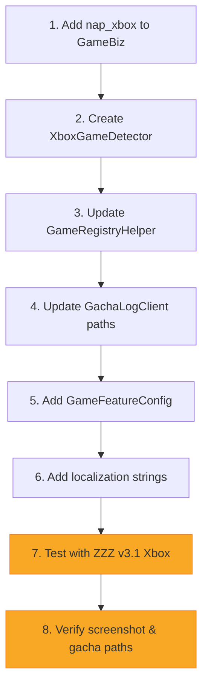

# Draft: ZZZ Xbox for PC Support — [Issue #21](https://github.com/studiobutter/Glowworm/issues/21)

Conversation Command: `agy --conversation=228107f1-d7de-4c91-86ba-6303b8f9580b`

> [!NOTE]
> This is a **pre-implementation draft**. Actual testing requires ZZZ v3.1 to be released on Xbox for PC.

> [!NOTE]
> As of version 3.1 release, the path is [GameInstallDir]/ZenlessZoneZero/Content/ZenlessZoneZero_Data
> Microsoft Store UUID: 41C9D967-39C0-47D9-8655-2EBD8A614DB6

---

## Overview

ZZZ v3.1 will add an Xbox for PC version with Windows Handheld optimizations. Glowworm needs to detect this install variant and support its **Screenshot** and **Gacha URL** features.

The key difference from existing installs: Xbox/Microsoft Store games do **not** register in the Windows Registry via HoYoPlay (`HKEY_CURRENT_USER\Software\Cognosphere\HYP\...`). Instead, the install location is discoverable through a `.GamingRoot` marker file placed at each drive root.

---

## Detection Strategy: `.GamingRoot` File

### How it Works

Xbox/Microsoft Store games write a `.GamingRoot` file to the root of the drive they're installed on (e.g., `E:\.GamingRoot`). This binary file encodes the relative install path.

### File Format

| Offset | Size | Description |
|--------|------|-------------|
| `0x00` | 4 bytes | Magic: `RGBX` (`52 47 42 58`) |
| `0x04` | 4 bytes | Version/flags (observed: `01 00 00 00`) |
| `0x08` | variable | UTF-16 LE null-terminated string — relative install path |

### Examples from Issue

| Install Location | Decoded Path |
|-----------------|--------------|
| `E:\XboxGames` | `XboxGames` |
| `E:\Games\XboxGames` | `Games\XboxGames` |

### ZZZ Game Path

From the Xbox install root:

```
[Drive]:\[Decoded Path]\Zenless Zone Zero\Content\
```

- **Screenshots**: `...\Content\ScreenShot`
- **Gacha URL Cache**: `...\Content\ZenlessZoneZero_Data\webCaches\[WebView Version]\Cache\Cache_Data`

---

## Files to Modify

### 1. New: `GameBiz` — Add Xbox variant

**File**: [GameBiz.cs](file:///C:/Users/Khang/Personal/Development/Glowworm/src/Glowworm.Core/GameBiz.cs)

```diff
 public const string nap_steam = "nap_steam";
 public const string nap_cloud = "nap_cloud";
 public const string nap_cloud_cn = "nap_cloud_cn";
 public const string nap_cloud_global = "nap_cloud_global";
+public const string nap_xbox = "nap_xbox";
```

Update `AllGameBizs`, `IsKnown()`, `IsGlobalServer()`, `GetGameRegistryKey()`, `ToGameServerName()`.

```diff
 // AllGameBizs
  nap_cloud_cn,
  nap_cloud_global,
+ nap_xbox,

 // IsKnown()
- nap_cn or nap_global or nap_bilibili or nap_epic or nap_steam or nap_cloud or nap_cloud_cn or nap_cloud_global => true,
+ nap_cn or nap_global or nap_bilibili or nap_epic or nap_steam or nap_xbox or nap_cloud or nap_cloud_cn or nap_cloud_global => true,

 // IsGlobalServer()
- public bool IsGlobalServer() => Server is "global" or "google" or "epic" or "steam" || ...
+ public bool IsGlobalServer() => Server is "global" or "google" or "epic" or "steam" or "xbox" || ...

 // ToGameServerName() — add new case
+ "xbox" => CoreLang.GameServer_Xbox,   // New localization key needed

 // GetGameRegistryKey() — Xbox doesn't use registry, return sentinel
  nap_global or nap_epic or nap_steam => GameRegistry.GamePath_nap_global,
+ nap_xbox => "HKEY_CURRENT_USER",  // No registry — uses .GamingRoot detection
```

---

### 2. New: `XboxGameDetector` utility class

**New File**: `src/Glowworm.Core/XboxGameDetector.cs`

A new utility class to scan drives for `.GamingRoot` files and locate Xbox game installs.

```csharp
using System.Text;

namespace Glowworm.Core;

/// <summary>
/// Detects Xbox for PC game installations by scanning
/// .GamingRoot files at drive roots.
/// </summary>
public static class XboxGameDetector
{
    private static readonly byte[] GamingRootMagic = { 0x52, 0x47, 0x42, 0x58 }; // "RGBX"

    /// <summary>
    /// Scans all fixed/removable drives for .GamingRoot files and
    /// returns the install path for ZZZ Xbox if found.
    /// </summary>
    public static string? GetZZZXboxInstallPath()
    {
        foreach (var drive in DriveInfo.GetDrives())
        {
            if (drive.DriveType is not (DriveType.Fixed or DriveType.Removable))
                continue;

            if (!drive.IsReady)
                continue;

            string gamingRootPath = Path.Combine(drive.RootDirectory.FullName, ".GamingRoot");
            if (!File.Exists(gamingRootPath))
                continue;

            string? xboxRoot = ParseGamingRoot(gamingRootPath, drive.RootDirectory.FullName);
            if (xboxRoot is null)
                continue;

            // ZZZ Xbox game content lives under:
            //   [xboxRoot]\Zenless Zone Zero\Content\
            string zzzPath = Path.Combine(xboxRoot, "Zenless Zone Zero", "Content");
            if (Directory.Exists(zzzPath))
            {
                return zzzPath;
            }
        }
        return null;
    }

    /// <summary>
    /// Parses a .GamingRoot file and returns the absolute Xbox games root.
    /// Format: [4-byte magic "RGBX"][4-byte version][UTF-16 LE null-terminated path]
    /// </summary>
    private static string? ParseGamingRoot(string filePath, string driveRoot)
    {
        try
        {
            byte[] data = File.ReadAllBytes(filePath);
            if (data.Length < 8)
                return null;

            // Verify magic bytes
            if (!data.AsSpan(0, 4).SequenceEqual(GamingRootMagic))
                return null;

            // Skip version/flags (4 bytes), read UTF-16 LE string
            int strStart = 8;
            if (strStart >= data.Length)
                return null;

            // Find null terminator (two consecutive 0x00 bytes on even boundary)
            int strEnd = strStart;
            while (strEnd + 1 < data.Length)
            {
                if (data[strEnd] == 0 && data[strEnd + 1] == 0)
                    break;
                strEnd += 2;
            }

            if (strEnd <= strStart)
                return null;

            string relativePath = Encoding.Unicode.GetString(data, strStart, strEnd - strStart);
            relativePath = relativePath.TrimEnd('\0').Trim();

            if (string.IsNullOrWhiteSpace(relativePath))
                return null;

            string fullPath = Path.Combine(driveRoot, relativePath);
            return Directory.Exists(fullPath) ? fullPath : null;
        }
        catch
        {
            return null;
        }
    }
}
```

---

### 3. Update: `GameRegistryHelper` — Xbox fallback

**File**: [GameRegistryHelper.cs](file:///C:/Users/Khang/Personal/Development/Glowworm/src/Glowworm.Core/GameRegistryHelper.cs)

```diff
 public static string? GetGameInstallPath(GameBiz biz)
 {
-    string? path = GetGameInstallPathFromRegistry(biz);
+    string? path;
+    if (biz.Value == GameBiz.nap_xbox)
+    {
+        path = XboxGameDetector.GetZZZXboxInstallPath();
+    }
+    else
+    {
+        path = GetGameInstallPathFromRegistry(biz);
+    }
     if (string.IsNullOrWhiteSpace(path) || !Directory.Exists(path))
     {
         return null;
     }
     return path;
 }
```

---

### 4. Update: `GachaLogClient` — Xbox cache path mapping

**File**: [GachaLogClient.cs](file:///C:/Users/Khang/Personal/Development/Glowworm/src/Glowworm.Core/Gacha/GachaLogClient.cs)

The Xbox version path structure differs — it's under `Content\ZenlessZoneZero_Data\webCaches\...` instead of directly under the install root.

```diff
 // GetGachaCacheFilePath — add nap_xbox case
 string file = gameBiz.Value switch
 {
     // ... existing cases ...
     GameBiz.nap_cn or GameBiz.nap_global or GameBiz.nap_bilibili or GameBiz.nap_epic or GameBiz.nap_steam => Path.Join(installPath, WEB_CACHE_ZZZ_PATH),
+    GameBiz.nap_xbox => Path.Join(installPath, WEB_CACHE_ZZZ_PATH),  // installPath already points to ...\Content
     _ => throw new ArgumentOutOfRangeException($"Unknown region {gameBiz}"),
 };

 // Same for the webCaches prefix switch
 string prefix = gameBiz.Value switch
 {
     // ... existing cases ...
     GameBiz.nap_cn or ... or GameBiz.nap_steam => @"ZenlessZoneZero_Data\webCaches",
+    GameBiz.nap_xbox => @"ZenlessZoneZero_Data\webCaches",
     _ => throw new ArgumentOutOfRangeException($"Unknown region {gameBiz}"),
 };

 // GetGachaUrlPattern — Xbox uses global servers
-    GameBiz.nap_global or GameBiz.nap_epic or GameBiz.nap_steam => SPAN_WEB_PREFIX_ZZZ_OS,
+    GameBiz.nap_global or GameBiz.nap_epic or GameBiz.nap_steam or GameBiz.nap_xbox => SPAN_WEB_PREFIX_ZZZ_OS,
```

---

### 5. Update: `GameFeatureConfig` — Xbox feature set

**File**: [GameFeatureConfig.cs](file:///C:/Users/Khang/Personal/Development/Glowworm/src/Glowworm/Features/GameFeatureConfig.cs)

```diff
 GameBiz.nap_global or GameBiz.nap_epic or GameBiz.nap_steam => nap_global,
+GameBiz.nap_xbox => nap_xbox,
 GameBiz.nap_bilibili => nap_bilibili,
```

Add new config:

```diff
+private static readonly GameFeatureConfig nap_xbox = new()
+{
+    SupportedPages =
+    [
+        nameof(ScreenshotPage),
+        nameof(GachaLogPage),
+    ],
+};
```

---

### 6. Update: `ScreenshotPage.xaml.cs` — Xbox screenshot path

**File**: [ScreenshotPage.xaml.cs](file:///C:/Users/Khang/Personal/Development/Glowworm/src/Glowworm/Features/Screenshot/ScreenshotPage.xaml.cs)

The Xbox version stores screenshots at `...\Content\ScreenShot`. Since `GetGameInstallPath` for `nap_xbox` will already return the `...\Content` directory, the existing `ScreenShot` relative path mapping (`GameBiz.nap => "ScreenShot"`) will work automatically — **no changes needed** in the screenshot relative path logic.

> [!IMPORTANT]
> This needs verification once v3.1 is installed. The screenshot folder may differ from the standard PC version.

---

### 7. Update: `ScreenshotPage2.xaml.cs` — Same as above

**File**: [ScreenshotPage2.xaml.cs](file:///C:/Users/Khang/Personal/Development/Glowworm/src/Glowworm/Features/Screenshot/ScreenshotPage2.xaml.cs)

Same consideration as `ScreenshotPage.xaml.cs`. The existing `nap => "ScreenShot"` mapping should work since the Xbox install path already resolves to `...\Content`.

---

## Summary of Changes

| File | Change Type | Description |
|------|-------------|-------------|
| [GameBiz.cs](file:///C:/Users/Khang/Personal/Development/Glowworm/src/Glowworm.Core/GameBiz.cs) | Modified | Add `nap_xbox` constant + update all switch expressions |
| `XboxGameDetector.cs` (new) | Added | `.GamingRoot` parser & drive scanner |
| [GameRegistryHelper.cs](file:///C:/Users/Khang/Personal/Development/Glowworm/src/Glowworm.Core/GameRegistryHelper.cs) | Modified | Route `nap_xbox` to `XboxGameDetector` instead of registry |
| [GachaLogClient.cs](file:///C:/Users/Khang/Personal/Development/Glowworm/src/Glowworm.Core/Gacha/GachaLogClient.cs) | Modified | Add `nap_xbox` to cache file path & URL pattern switches |
| [GameFeatureConfig.cs](file:///C:/Users/Khang/Personal/Development/Glowworm/src/Glowworm/Features/GameFeatureConfig.cs) | Modified | Add `nap_xbox` feature config (Screenshot + Gacha) |
| Localization | Modified | Add `GameServer_Xbox` string |

---

## Open Questions & Risks

> [!WARNING]
> These questions **cannot be answered until v3.1 is available for testing**:

1. **Web cache path** — Does the Xbox version use the same `ZenlessZoneZero_Data\webCaches\...\data_2` path structure, or does Microsoft Store sandboxing redirect it?
2. **Multiple `.GamingRoot` entries** — Can a single `.GamingRoot` file contain multiple game root paths? (Only one has been observed per file so far.)
3. **UWP/MSIXVC sandboxing** — Xbox for PC games often run in an AppContainer. Can Glowworm read the `Content` directory and `data_2` cache file without special permissions?
4. **Screenshot path** — Is it `ScreenShot` under `Content`, or does Xbox redirect screenshots elsewhere (e.g., Xbox Game Bar captures to `Videos\Captures`)?
5. **Game registry for gacha** — The Xbox version might still write *some* registry keys for the HoYoverse account binding. Needs investigation.
6. **Auto-detection in UI** — Should the Xbox variant appear automatically in the game selector when detected, or require manual setup?

---

## Implementation Order



> [!TIP]
> Steps 1–6 can be implemented now as a draft PR. Steps 7–8 are **blocked** until ZZZ v3.1 releases on Xbox for PC.
